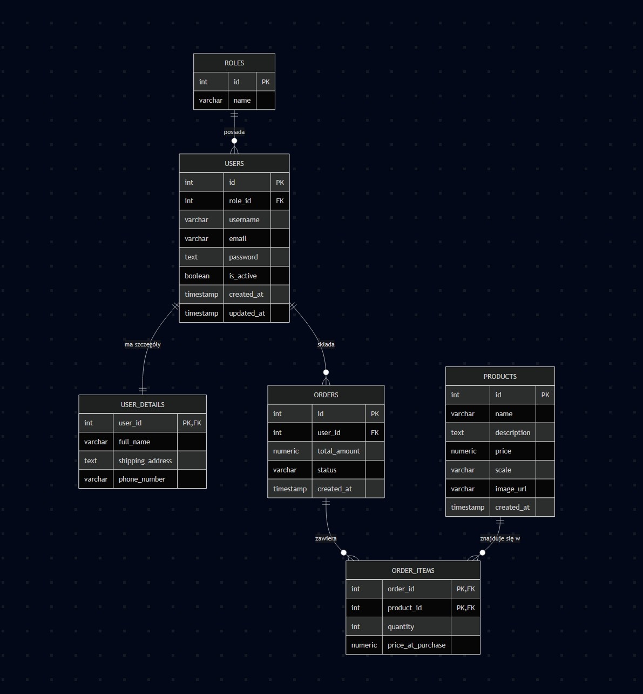

# MOUNTAIN CRAFT - Sklep z makietami górskimi

Projekt zaliczeniowy z przedmiotu **„Wstęp do Projektowania Aplikacji Internetowych”**.

Aplikacja to autorski framework PHP zaimplementowany zgodnie z architekturą **MVC**, bez użycia gotowych szablonów i frameworków. Służy do przeglądania i zakupu trójwymiarowych makiet górskich.

---

# 1. Instrukcja uruchomienia i komendy bazowe

Aby uruchomić projekt lokalnie, upewnij się, że posiadasz zainstalowanego **Dockera** oraz **Docker Compose**.

## Uruchomienie aplikacji

1. Sklonuj repozytorium.
2. Skopiuj plik `.env.example` do `.env` i uzupełnij zmienne (jeśli wymagane).
3. Uruchom kontenery w tle:

```bash
docker-compose up -d --build
```

Aplikacja będzie dostępna pod adresem:

```text
http://localhost:8080
```

(lub innym porcie zdefiniowanym w konfiguracji).

---

## Czyszczenie bazy danych (reset projektu)

Jeśli chcesz zresetować bazę danych do stanu początkowego (ponownie uruchomi się `init.sql`):

```bash
docker-compose down -v
docker-compose up -d --build
```

---

## Nadawanie uprawnień administratora

1. Zarejestruj nowe konto w aplikacji używając adresu:

```text
admin@mountain.pl
```

2. Otwórz terminal i wykonaj poniższą komendę, aby zaktualizować rolę użytkownika w bazie PostgreSQL:

```bash
docker-compose exec db psql -U docker -d db -c "UPDATE users SET role_id = 2 WHERE email = 'admin@mountain.pl';"
```

Po ponownym zalogowaniu konto będzie posiadało uprawnienia administratora (dostęp do zabezpieczonych ścieżek `requireAdmin()`).

---

# 2. Architektura i technologie

Aplikacja opiera się na autorskim rozwiązaniu inspirowanym wzorcem **MVC (Model–View–Controller)** i została napisana zgodnie z zasadami programowania obiektowego oraz wybranymi zasadami **SOLID**.

## Backend

- PHP 8+
- Programowanie obiektowe
- Brak kodu strukturalnego

## Frontend

- HTML5
- CSS3
- JavaScript
- Fetch API
- Responsywny, autorski interfejs użytkownika

## Baza danych

- PostgreSQL
- Relacyjna baza danych
- Projekt zgodny z 3. postacią normalną

## Infrastruktura

- Docker
- Docker Compose

## Routing i bezpieczeństwo

- Autorski router
- Middleware
- Atrybuty PHP 8 (`#[AllowedMethods]`)
- Ochrona endpointów

---

# 3. Struktura projektu

```text
src/
├── controllers/   - Kontrolery obsługujące żądania
├── models/        - Modele odwzorowujące tabele bazy danych
├── repository/    - Warstwa dostępu do danych (PDO)
├── middleware/    - Middleware i logika autoryzacji

public/
└── views/         - Widoki HTML/PHP

docker/
├── nginx/
├── php/
├── postgres/
└── init.sql
```

### Najważniejsze katalogi

#### `src/controllers/`

Kontrolery obsługujące żądania HTTP, np.:

- `SecurityController`
- `ProductController`

#### `src/models/`

Klasy mapujące rekordy bazy danych na obiekty.

Przykład:

- `Product.php`

#### `src/repository/`

Klasy komunikujące się z bazą danych przy użyciu PDO oraz prepared statements.

Przykład:

- `UserRepository.php` (Singleton)

#### `src/middleware/`

Logika przechwytująca żądania:

- autoryzacja
- weryfikacja ról
- sprawdzanie metod HTTP
- obsługa atrybutów

#### `public/views/`

Widoki napisane w czystym PHP/HTML.

Wszystkie dane wyświetlane użytkownikowi są zabezpieczane przez:

```php
htmlspecialchars()
```

#### `docker/`

Konfiguracja środowiska:

- Nginx
- PHP
- PostgreSQL
- plik inicjalizacyjny `init.sql`

---

# 4. Scenariusz testowy (dla prowadzącego)

## Rejestracja i walidacja

Spróbuj zarejestrować użytkownika bez podania adresu e-mail.

**Oczekiwany rezultat:** błąd walidacji formularza.

---

## Logowanie i limit prób

1. Zaloguj się.
2. Wyloguj się.
3. Wprowadź błędne hasło 5 razy.

**Oczekiwany rezultat:** aktywacja czasowej blokady logowania (ochrona przed brute-force).

---

## Role i ochrona zasobów

Przejdź jako niezalogowany użytkownik na:

```text
http://localhost:8080/dashboard
```

**Oczekiwany rezultat:** przekierowanie do strony logowania.

---

## CRUD i transakcje

Aplikacja wykorzystuje bezpieczne transakcje PDO:

```php
beginTransaction()
commit()
rollBack()
```

Przykładowe zastosowanie:

- aktualizacja danych produktu
- operacje wymagające spójności danych

---

## Wyzwalacze i widoki

### Trigger

Zmiana danych użytkownika uruchamia trigger:

```sql
update_users_timestamp
```

który aktualizuje kolumnę:

```sql
updated_at
```

### Widoki

Widok:

```sql
v_user_orders_summary
```

agreguje dane pochodzące z wielu tabel.

---

# 5. Security Bingo (zrealizowana kolumna A)

| A (ZREALIZOWANE) 🟢 | B | C | D | E |
|---------------------|---|---|---|---|
| 🟢 Ochrona przed SQL Injection (prepared statements) | | | | |
| 🟢 Nie zdradzam, czy email istnieje | | | | |
| 🟢 Walidacja adresu email po stronie serwera | | | | |
| 🟢 UserRepository jako Singleton | | | | |
| 🟢 Login i rejestracja wyłącznie przez HTTPS | | | | |
| 🟢 Login/Register przyjmuje dane tylko metodą POST | | | | |
| 🟢 CSRF token w formularzu logowania | | | | |
| 🟢 Ograniczanie długości danych wejściowych | | | | |
| 🟢 Hasła przechowywane jako hash (bcrypt/Argon2) | | | | |
| 🟢 Hasła nie są logowane | | | | |
| 🟢 CSRF token w formularzu rejestracji | | | | |
| 🟢 Cookie sesyjne z flagą Secure | | | | |
| 🟢 SameSite dla ciasteczek | | | | |
| 🟢 Limit prób logowania i blokada czasowa | | | | |
| 🟢 Regeneracja ID sesji po logowaniu | | | | |
| 🟢 Ochrona przed XSS (`htmlspecialchars`) | | | | |
| 🟢 Brak stack trace w środowisku produkcyjnym | | | | |
| 🟢 Poprawne kody HTTP (400/401/403/405) | | | | |
| 🟢 Cookie z flagą HttpOnly | | | | |
| 🟢 Hasło nie trafia do widoków | | | | |
| 🟢 Poprawne wylogowanie i niszczenie sesji | | | | |
| 🟢 Audyt nieudanych prób logowania | | | | |

---

# 6. Checklista zrealizowanych wymagań

- [x] Aplikacja napisana obiektowo (MVC, brak kodu strukturalnego)
- [x] Wykorzystane technologie: Docker, HTML5, CSS3, JavaScript, PHP 8, PostgreSQL
- [x] Logowanie, rejestracja, wylogowanie i utrzymanie sesji
- [x] Weryfikacja ról użytkowników podczas działania aplikacji
- [x] Relacje między tabelami (1:1, 1:N, N:M)
- [x] Minimum dwa widoki wykorzystujące JOIN
- [x] Minimum jeden trigger i jedna funkcja w bazie danych
- [x] Transakcje realizowane za pomocą PDO
- [x] Kod udostępniony w publicznym repozytorium

---

# 7. Dokumentacja wizualna

## Diagram ERD

```markdown
[Diagram ERD bazy danych](./public/img/erd.png)
```

---

## Diagram architektury warstwowej (MVC)

```markdown
[Architektura MVC](./public/img/mvc.png)
```

---

# Ostatni krok przed obroną

W dokumentacji pozostawiono placeholdery przeznaczone do wstawienia:

- diagramu ERD,
- diagramu architektury,
- zrzutów ekranu aplikacji.

Przed oddaniem projektu należy podmienić pliki placeholderów na rzeczywiste grafiki wygenerowane np. przy pomocy:

- DBeaver
- draw.io
- Lucidchart
- dbdiagram.io

Przykład:

```markdown

```

Dzięki temu dokumentacja będzie kompletna i zgodna z wymaganiami projektu.